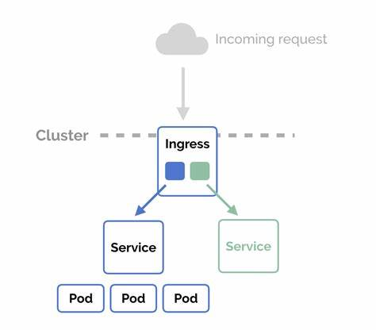

## Ingress

* Kubernetes Ingress is an API object that provides routing rules to manage external users access to the services in a Kubernetes cluster. 
* Ingress can provide load balancing, SSL termination and name-based virtual hosting.
* We must add ingress in our kubernetes minikube cluster to access our services from outside the cluster by specifying the customized path and host name for each microservice, also to manage load balancing.

To read more about ingress, you can check k8s documentation :
[Ingress k8s doc](https://kubernetes.io/docs/concepts/services-networking/ingress/)

